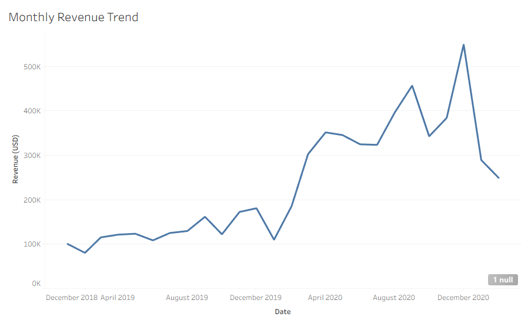
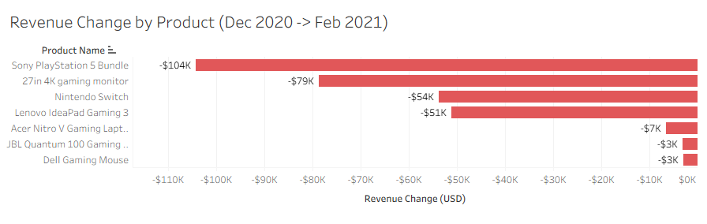
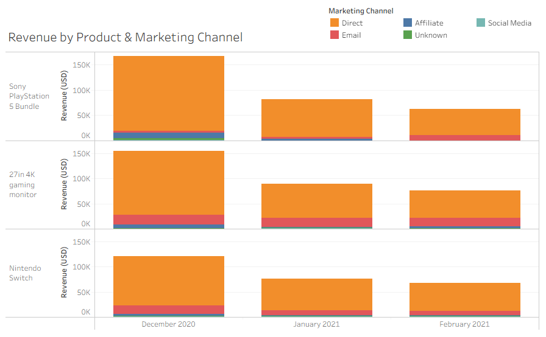
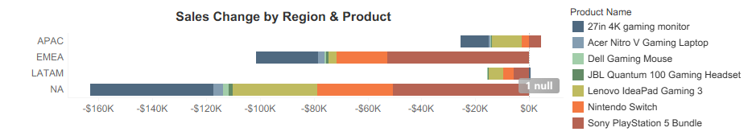

# Project Background
Gamezone is a global e-commerce retailer specializing in gaming hardware and consoles, selling directly to consumers across multiple regions. Between 2019 and early 2021, the company experienced significant volatility in demand, creating uncertainty around product performance, marketing effectiveness, and regional sales trends. 

Despite collecting detailed transaction-level data on sales, products, marketing channels, and regions, this data had not been fully leveraged to understand the drivers behind revenue growth and decline. This project thoroughly analyzes and synthesizes this data to **identify trends driving revenue growth and decline** and uncover actionable insights that will improve Gamezone's commercial success. 

Insights and recommendations are provided on the following key areas:

- **Sales Trends Over Time:** Analysis of monthly revenue, order volume, and average order value to identify patterns and to inform revenue forecasting.  
- **Product Performance:** Evaluation of individual product lines to understand top performers, underperforming products, and the drivers behind revenue changes. 
- **Marketing Channel Impact:** Assessment of marketing channel effectiveness (direct, email, social media, etc) on sales trends, highlighting opportunities to optimize marketing spend and improve ROI. 
- **Regional Performance:** Evaluation of revenue trends by region to identify geographic strengths and weaknesses and to inform regional sales strategies.  

### Interactive Dashboard

An interactive Tableau dashboard used to explore sales trends, product performance, marketing channels, and regional patterns can be found here:  
🔗 [View the interactive Tableau dashboard]([https://public.tableau.com/views/YourDashboardName](https://public.tableau.com/views/gamezone_tableau_dashboard/SalesPerformanceDashboard?:language=en-US&publish=yes&:sid=&:redirect=auth&:display_count=n&:origin=viz_share_link)

# Data Structure & Initial Checks

Before analysis, the dataset was reviewed to understand its structure, data types, and key fields relevant to business performance. Initial quality checks were conducted in Excel to confirm consistent date formats, valid revenue values, and complete product, region, and marketing classifications. 

| Column Name       | Data Type | Description                                 |
|------------------|-----------|---------------------------------------------|
| Order ID          | string    | Unique identifier for each order            |
| Product Name      | string    | Name of the purchased product               |
| Purchase Date     | date      | Date the order was placed                    |
| USD Price         | float     | Revenue from each order                      |
| Marketing Channel | string    | Channel through which order originated      |
| Region            | string    | Geographic region of the customer           |

# Executive Summary

### Overview of Findings

Between 2019 and early 2021, the company experienced rapid revenue growth followed by a sharp **55% decline** in early 2021. While this downturn broadly aligns with post-pandemic demand normalization, deeper analysis reveals that the decline was disproportionately driven by **three core products**. The Sony PlayStation, Gaming Monitor, and Nintendo Switch accounted for **80% of total revenue**, with the **Direct marketing channel** accounting for **85% of revenue**. Regional analysis reveals that the downturn was global in nature, with **North America accounting for 54% of total revenue losses**, particularly in PlayStation sales. The following analysis explores these patterns in detail and highlights key opportunities to stabilize revenue and optimize channel and product strategy. 

# Insights Deep Dive
### Sales Trends:

* **Revenue peaked in December 2020  following sustained growth since 2018, then declined ~~55% by February 2021.** This drop reflects demand normalization after elevated pandemic-era holiday sales.
  
* **Peak-to-trough analysis identifies periods of heightened revenue risk.** The sharp December-February swing highlights when the company is most vulnerable to demand volatility, which informs timing for forecasting and cash flow planning. 
  
* **Short-term volatility masked underlying demand resilience.** Despite the early 2021 drop, monthly revenue remained above pre-pandemic 2019 levels, showing that baseline demand remained strong. 

### Product Performance:

* **Revenue was heavily concentrated in three core products.** The Sony PlayStation, Gaming Monitor, and Nintendo Switch collectively accounted for **80% of total revenue**, making them the primary drivers of growth and decline. PlayStation experienced the steepest drop, falling from $167K → $63K, while Switch and Monitor declined less sharply.  
  
* **Minor products contributed minimally but highlight opportunities.** Products, like the Headset, accounting for <2% of revenue, could be bundled or promoted to diversify revenue streams and reduce concentration risk.  
  
* **Relative product contribution to decline varies by product.** PlayStation alone accounted for ~35% of the total revenue drop, highlighting the company’s exposure to high-impact product performance.

### Marketing Channel Analysis:

* **Direct channel dominates revenue** Approximately **85% of sales** occurred through Direct marketing channels, highlighting heightened exposure to shifts in consumer behavior.
  
* **Product-level declines were driven by heavy reliance on Direct marketing channels.** All three top products experienced sharp revenue drops, but the impact was most pronounced for the PlayStation, which fell **64%** in Direct channel sales alone, highlighting channel-specific vulnerability. 
  
* **Underutilized channels present growth opportunities.** Minimal contribution from email, affiliate, and social media channels indicates untapped potential to diversify revenue streams and mitigate risk. 

### Regional Trends:

* **Revenue declines were global, but NA drove the majority of losses.** Between December 2020 and February 2021, all regions experienced downturns, but NA accounted for **54% of total revenue loss**, making it the primary contributor to the overall contraction.

* **Top product declines were amplified by regional concentration.** All top three products fell sharply in NA, with PlayStation revenue declining by over **66%** during the period. Similar directional trends across products suggest the downturn was broad-based rather than product-specific. 
  
* **Geographic diversification could stabilize revenue.** Reliance on NA revenue for top products exposes the company to regional market shifts; expanding sales in Europe or APAC could mitigate future risk.

# Recommendations:

Based on the insights uncovered in this analysis, the following recommendations are proposed to improve revenue stability and reduce concentration risk: 

* With approximately 80% of revenue concentrated in three products, performance volatility in any one product has an outsized impact on total revenue. **Expanding accessory offerings and introducing product bundles tied to core products can diversify revenue while capitalizing on existing demand.**
  
* The Direct marketing channel generated approximately 85% of total revenue, amplifying exposure when demand softened. **Strengthening non-direct channels (email, affiliate, and social media) would reduce single-channel dependency and stabilize acquisition during downturns.**
  
* PlayStation experienced the steepest decline and accounted for a disproportionate share of total revenue loss, particularly in North America. **Reassessing regional pricing, inventory allocation, and promotional strategies for PlayStation in NA can help determine whether the decline reflects market saturation or execution gaps.**
  
* Sharp post-holiday peak-to-trough declines indicate sensitivity to seasonal demand normalization. **Incorporating post-holiday adjustments into forecasting, inventory planning, and promotional timing could reduce revenue volatility after peak sales periods.**
  
* Low-revenue products contribute minimally on their own, with products like the headsets making up less than 2% of revenue. **Leveraging these products through bundles or add-on promotions may increase average order value before considering discontinuation.** 

# Assumptions and Caveats:

Throughout the analysis, multiple assumptions were made to manage challenges with the data. These assumptions and caveats are noted below:

* Revenue trends are used as a proxy for customer demand. This analysis does not account for potential inventory constraints or supply chain disruptions. 
  
* Marketing channel attribution reflects the channel associated with each order and does not capture multi-touch or cross-channel customer journeys. 
  
* Regional analysis assumes consistent pricing and product availability across markets. Regional differences in promotions or logistics were not evaluated. 
